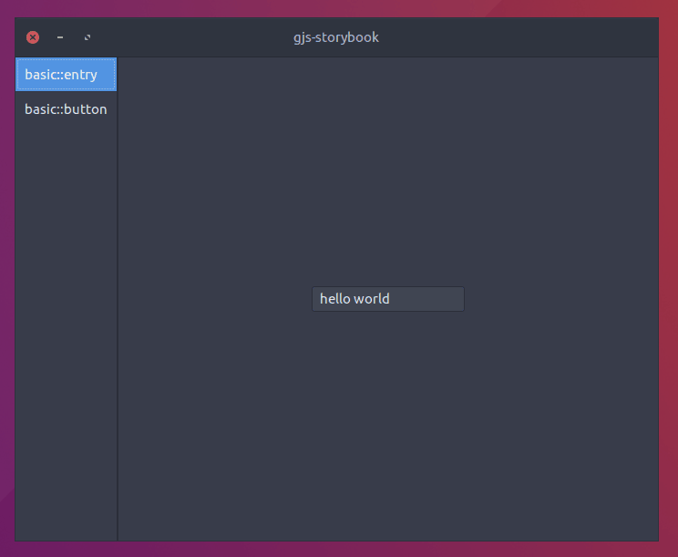

# gjs-storybook

Inspired by [`storybook`](https://github.com/storybooks/storybook) and [`granite-demo`](https://github.com/elementary/granite).

Supports hot reload via webpack.



## Install

```sh
$ yarn install
```

## Usage

See `./examples`

## Related

- [`cgjs`](https://github.com/cgjs/cgjs)

## License

MIT © [ewnd9](http://ewnd9.com)
